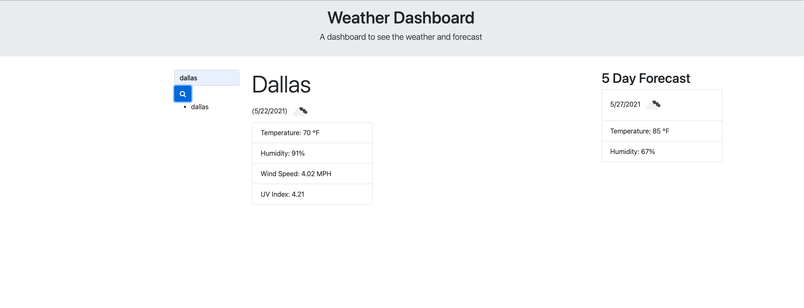

# 06 Server-Side APIs: Weather Dashboard

​

# Badge: 

# Table of Contents

1. [Description](#description)
2. [Technologies Used](#technologies-used)
3. [Installation](#installation)
4. [Usage](#usage)
5. [Contributions](#contribution)
6. [License](#license)
7. [Testing Instructions](#testing-instructions)
8. [Questions](#questions)

# Description

This application is used to display the current weather and forecast of weather for searched city

# Technologies Used

HTML
CSS
JavaScript

# Installation

None

# Usage

When submitting a city, the weather dashboard will pull the current weather and forecast

# Contributions

None

# License

This project is licensed under MIT

# Testing Instructions

I tested this project using Live Server

# Questions

1. My Github Profile: https://github.com/kjackson206
2. This Project: https://kjackson206.github.io/weather-dashboard/
3. My Email: katherine.jackson206@gmail.com
